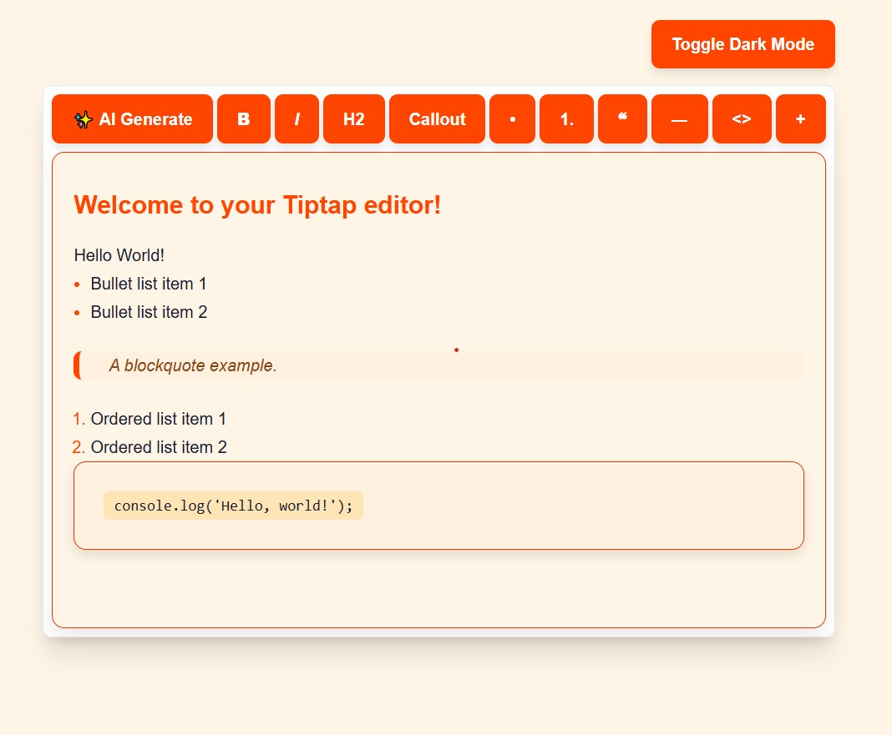
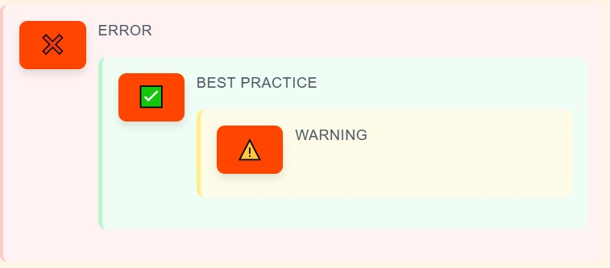
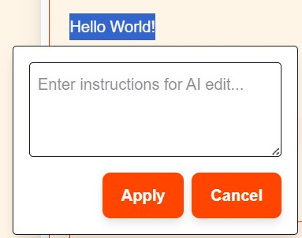

# TipTap Editor 
This repository contains the implementation of a feature-rich Tiptap editor with custom extensions, styling enhancements, and dark mode support. The editor allows users to perform rich text editing with features like headings, lists, blockquotes, callouts, and more.
## 🖼️ Screenshot


# ✨ Features
### 📝 Rich Text Editing
- Bold, Italic, and Inline Code
- Headings(H2)
- Blockquotes
- CodeBlock
- Horizontal Rule
- Bullet and Numbered Lists
- AI Inline Edit: Edit selected text using AI.
- AI Generate Sentence: Instantly generate contextual sentences using AI.


### 🧩 Custom Extensions
- **Callout Node**: Emphasize important content using a styled callout box.
- **Keyboard Shortcut for Callout**: Press `Alt + C` to insert a callout instantly.
- **AI Edit Extension**: Select any text and choose AI Edit to rewrite or improve content.
- **Slash Commands**: Type `/` in the editor to quickly access formatting commands.

  
  

### 🌗 Dark Mode Support
- Seamless toggle between light and dark themes for better accessibility.

  
# Clone the repository
```bash
git clone https://github.com/Aman-Dokania/proteanics_assessment_shashank_aman_dokania.git
```
# Navigate into the project directory
```bash
cd proteanics_assessment_shashank_aman_dokania
```

# Install dependencies
```bash
npm install
```
# 🛠️ Environment Setup
Create a ```.env.local``` file in the root directory of your project and add the following key:

```bash
NEXT_PUBLIC_GEMINI_API_KEY=your_gemini_api_key_here
```

First, run the development server:

```bash
npm run dev
# or
yarn dev
# or
pnpm dev
# or
bun dev
```

Open [http://localhost:3000](http://localhost:3000) with your browser to see the result.


